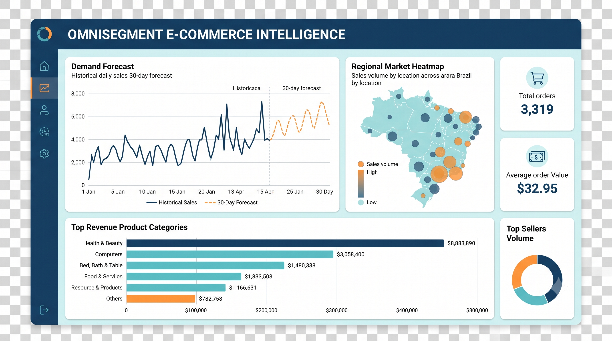
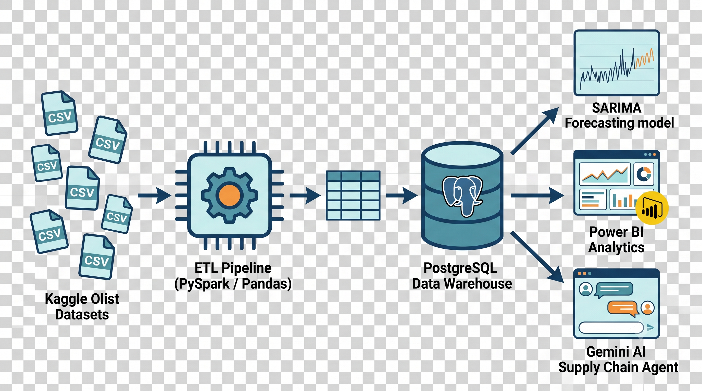

# OmniSegment E-Commerce & Supply Chain Intelligence

This repository contains an end-to-end data engineering and analytics pipeline designed to optimize e-commerce supply chain operations. By processing massive relational datasets, generating time-series forecasts, and integrating an autonomous AI agent, this project bridges the gap between raw transaction records and actionable procurement strategies.

## Project Architecture

* **ETL Pipeline:** Built with **PySpark** and **Pandas** to process millions of rows from the Olist e-commerce dataset, seamlessly joining orders, geolocation data, payments, and product dimensions into a clean master schema.
* **Predictive Modeling:** Utilizes the **SARIMA** algorithm (via `statsmodels`) to generate a rolling 30-day demand forecast based on historical daily sales volume.
* **Database Layer:** **PostgreSQL** serves as the central data warehouse, hosting the comprehensive `ecommerce_master` dataset and the `sales_predictions` table.
* **AI Supply Chain Agent:** A custom Python application powered by the **Google Gemini 3.6-Flash API**. The agent is equipped with localized SQL tools to autonomously retrieve forecasted sales and top category metrics, providing immediate, data-backed inventory recommendations.

## Key Analytical Features

* **Geospatial Analysis:** Leverages customer zip code prefixes to build geospatial density heatmaps, instantly identifying high-value regional fulfillment hubs.
* **Revenue Performance Tracking:** Employs precise bar charts for revenue per session data, ensuring highly accurate performance comparisons across different marketing channels and product segments.
* **Automated Decision Support:** The interactive AI agent processes multi-turn prompts to recommend stock replenishment and procurement strategies based on live database queries.

## Getting Started

1. Ensure **PostgreSQL**, **Python 3.12**, and **Git** are installed on your local machine.
2. Clone the repository and configure your `.env` file with your database credentials and Gemini API key.
3. Run `python src/pipeline.py` to ingest the CSVs, compute the SARIMA forecast, and populate the database.
4. Run `python src/agent.py` to launch the interactive supply chain analyst in your terminal.
